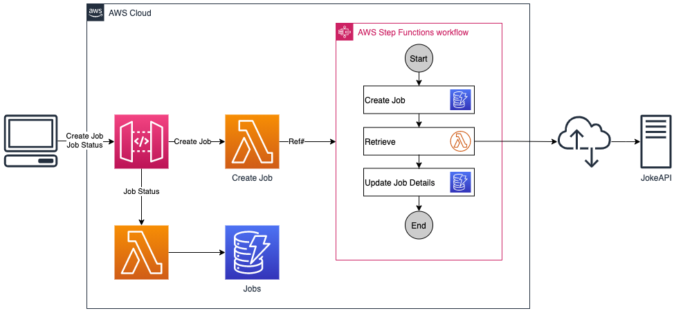

# Workbench for AWS Step Functions

This workbench project is used to experiment with [AWS Step Functions](https://aws.amazon.com/step-functions/).

The application uses a workflow to retrieve a joke from [JokeAPI](https://jokeapi.dev/) and store the result in a
[DynamoDB](https://aws.amazon.com/dynamodb/) table in anasynchronous way.

There are two endpoints that can be used by clients. The first endpoint is used to create a new job that will retrieve
a joke. The second endpoint allows the client to query the current state of the job and get the joke, after the job has
been completed.
## Resources

* [JokeAPI](https://jokeapi.dev/)
* [DynamoDB](https://aws.amazon.com/dynamodb/)
